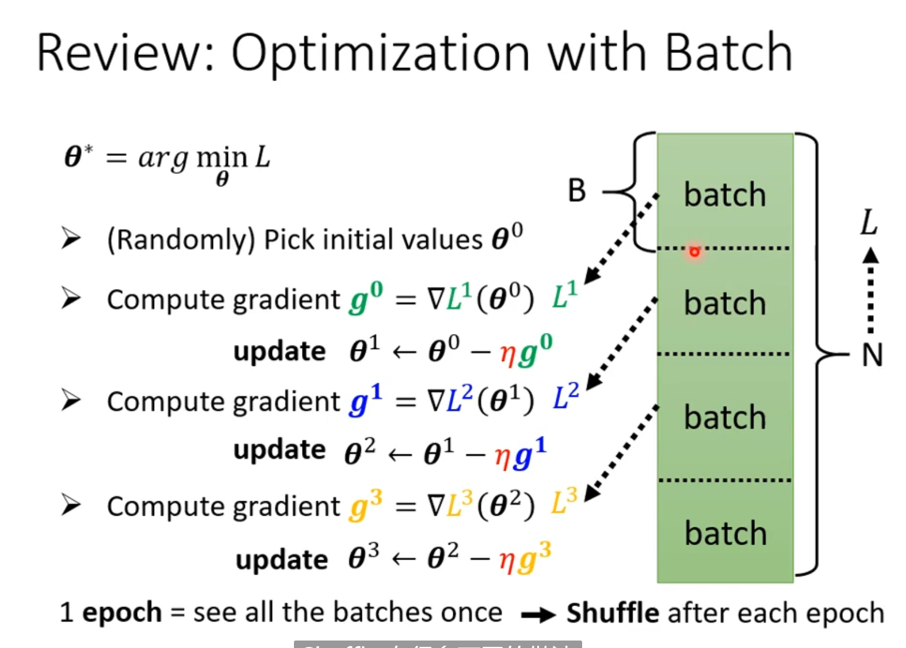
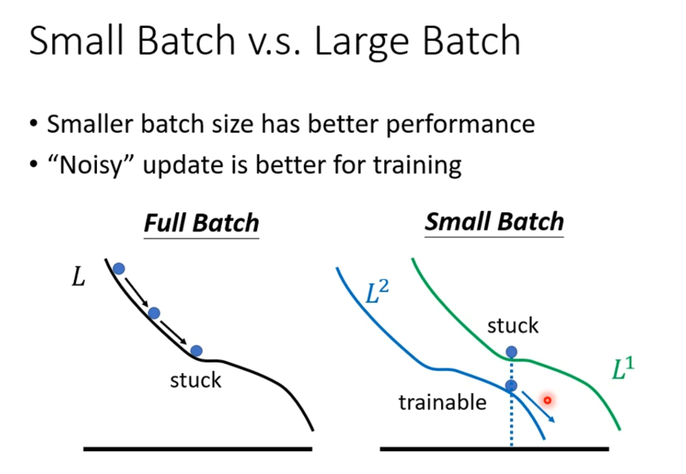
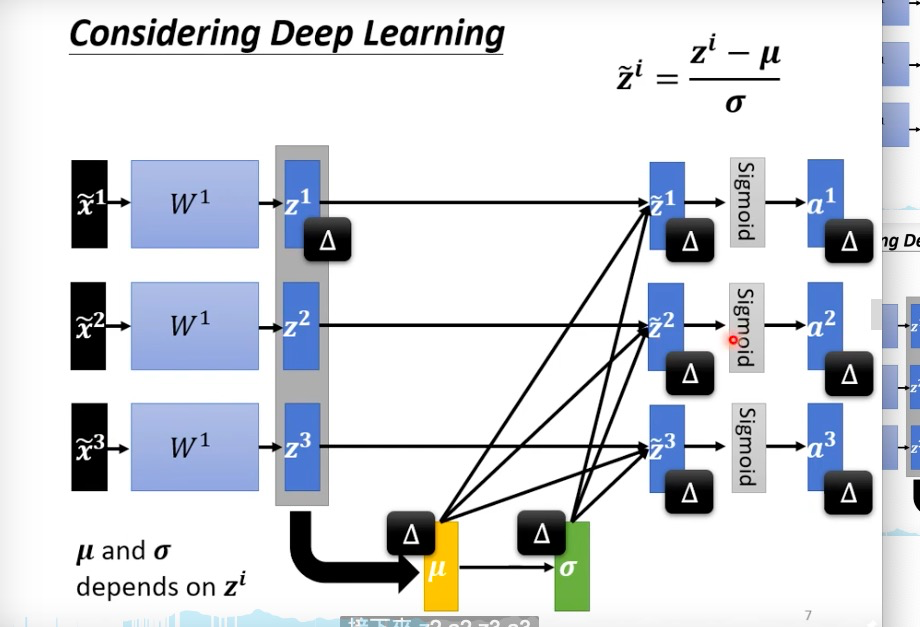

## Framework of ML

- #### From testing data

1. function : $y=f_{\boldsymbol{\theta}}(\mathbf{x})$
2. Loss Fuction : $L(\pmb{\theta})$
3. Optimization : $\boldsymbol{\theta}^*= \arg \min _{\theta} L$
4. 

- #### To training data

### Genral Guide

- #### Model Bias

  - the model is too simple, so that it can't express this task.
  - all more feartures & more deep neurons
  - def the fuction set : $f\in \pmb{S}$
    - $f^*(\pmb{x}) \notin \pmb{S}$

- ### Optimization Issue

- def the fuction set : $f\in \pmb{S}$

  - $f^*(\pmb{x}) \in \pmb{S}$ but **can't find it**
  - 

- ### But which One?

- 

- ~~Overfitting~~

- ~~model bias~~

- [x] **Optimization** 

  - more insight\shallower--> easy to optimize
  - 

  - 

- #### Overfitting

- 

- 

- ### Model's flexibility depends on the scale(规模) of data

  

- **data arugmentation(数据增强)**

- add limitation => **constrained model**

  

- Less parameters, sharing parameters
  - $S_{full-connecter} \supset S_{CNN}$
- Less features
- Early stopping
- Regularization
- Dropout

- not too much
  - In **information theory** , simple model losses many informations, and complex model can't generalization more condition.

- K-fold cross validation
- 

- ### dismatch

- 

---

## When gredient is small...

## (1)Local minima and saddle point

- In optimization, how to make gradient decent better ?
- 

- 多元函数极值（Extremum of a function of several variables）的定义：

  

  $$
  H_{ij}=\frac{\partial^2}{\partial \pmb{\theta_i}\partial \pmb{\theta_j}}L(\pmb{\theta \ '})
  $$
  
  
  
  

$$
\left\{\begin{matrix}
 &  
 &  
\end{matrix}\right.
$$

- H 正定 => 特征值 >0 => 局部最小
- H 负定 => 特征值 <0 => 局部最大
- H 有正有负 => 鞍点

- #### 特征向量**u**指向梯度方向，

  

### When you have lots of parameters, perhaps local minima is rare ?

- #### In the rigthest point, though, nearly 55% are positive.

- #### Thus, 45% points are negative, which means it have posibility to decrease.

  ---

### Tip for training: Batch and Momentum-

- Why batch?

  

- 

- 考虑平行，并行
- consider parallel 

- So the  big batch needs the less time and more "powerfull"?
- 

- Actually, smaller batch size perform better.
- 

- better Minima ==> More robustness （steady）

- small batch 
- 

- ### Momentum

- 

- ####  this gradient direction depends on both this gradient and all past dirctions

---

### Classification (Short Version)

- ### Softmax was binding with Cross-entropy

  

- 交叉熵：**Cross-entropy => avoid the gradient disappeared**

## Batch Normalizaton

- Changing Landcsape
- 

- Feature Nomalization

$$
\pmb{\tilde{x}^r} \leftarrow \frac{\pmb{x_i^r} - m_i}{\sigma_i}
$$

- Feature normalization before\after sigmoid 

- In feature normalization, $\tilde{z}^1,\tilde{z}^2,\tilde{z}^3$ is connnected with $z^1$
- **In formal model, each output $a^i$ is independent; but afer normalization, it all taken into a large network.** 
  - if $\tilde{x}^1$ changed, all the output $a^1,a^2,a^3$ will change 
- In real task, this normalization is done in each **batch**, so call it **"batch normalization"**
- 

- inference == testing 
- 

- Internal Covariate Shift ?
- 

