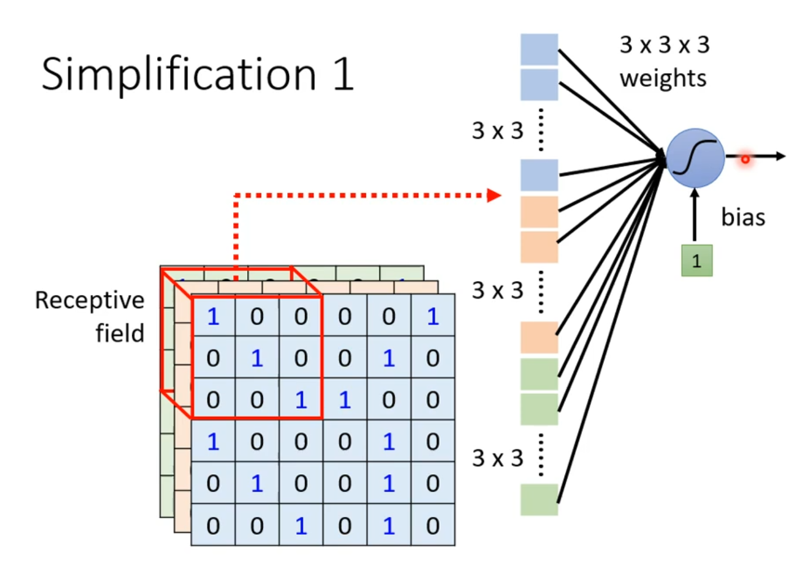
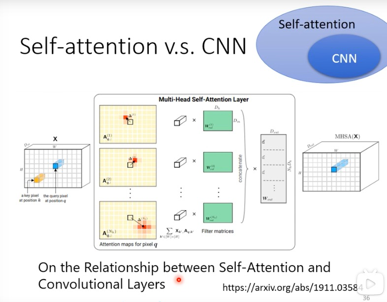

## Convolutoinal Neural Network (CNN)

- input 100*100
- output : one hot vector $\hat{y}$

- dimention of  $\hat{y}$ decide how many kinds model can classify

  

- Image in computer:
  - ```tensor```
  - RGB : 3 channel


- **Too many parameters=>Overfitting**

- ### consider the image's feature, there's no need to "fully connected"

  - #### Observation1

    - Identifying some critical patterns (like human)
    - Some pattern are much smaller => **no need to see whole image**
    - 

  - #### Simplification1

    - receptive field (感受野)
    - 
    - 
      - there appears **Same receptive field, Overlapped receptive field** 
      - different sizes of receptive field, just in some channels  ...
    - Simplification1--**Tipical Setting**
      - all channels, kernal size (3*3) 
      - each receptive field has **a set of neurons**
      - stride=1, 2
      - overlap--padding (补值)
      - 

  - #### Observation2

    - The same patterns appear in different regions
    - 
    - sharing parameter
    - 
    - 
    - Two receptive field would sharing parameters 
    - Simplification 2--Typical Setting
    - 
    - 

- #### Another narrative way

- 

- 

- the parameters in Filters are learned by Gradient decent

- 

- 

- 

- 3 channels image => 64fliter convolution 1 => 64 channels image

- **each convolution-> a compress (压缩) of information in image**

- 

- 


- Observation3
  - 
  - Pooling
  - 
  - 
  - may no pooling
  - 
  - 

---

### Self-attention (1)


- One-hot Encoding
  - No relatoin
- Word Embedding
  - cluster (a group)


- rolling window

  

  

  #### Output


- POS tagging (part-of-speech label )


- **Output**

  - Each vector has a label *(focus of)*
  - The whole sequence has a label
  - Model decides the number of labels itself (**seq2seq**)

- Sequence labeling (Each vector has a label)

  - 

  - Consider the context ?

  - 

  - Consider the Sequence ?

    - ~~a window cover the whole sequence~~

    - **Self - attention**

    - 

    - How self attention consider the whole sequence ?

    - 

    - 

    - > Attention is all you need:https://arxiv.org/abs/1706.03762

      

  - Self attention principle

    

  - 

  - Find the relevant vectors in a sequence 

    - Dot-product   $\alpha=\pmb{q\cdot k}$
    - Additive

  - 

  - $$
    \alpha_{i,j}=W^q\pmb{a^i}\cdot W^k\pmb{a^j} \\
    \alpha_{i,j}'=\frac{e^{\alpha_{i,j}}}{\sum_j e^{\alpha_{i,j}}}
    $$

  - 

  - $$
    \pmb{b^i}=\sum_{j} \alpha_{i,j}' \pmb{v^i}\\
    \pmb{v^i}= W^v \pmb{a^i}
    $$

  - All in one :

  - $$
    Attention:
    \left\{\begin{matrix}
     \pmb{b^i}=\sum_{j} \alpha_{i,j}' \pmb{v^i}\\
    \pmb{v^i}= W^v \pmb{a^i} \\
    \alpha_{i,j}'=\frac{e^{\alpha_{i,j}}}{\sum_j e^{\alpha_{i,j}}} \\
    \alpha_{i,j}=W^q\pmb{a^i}\cdot W^k\pmb{a^j} \\
    
    \end{matrix}\right.
    $$

  - 

  - 
  
  - 
  
  - $$
    Matrix\left\{\begin{matrix}Q=W^q I &(\pmb{q^i}=W^q\pmb{a^i})\\K=W^k I &(\pmb{k^i}=W^k\pmb{a^i})\\V=W^v I &(\pmb{v^i}=W^v\pmb{a^i})\end{matrix}\right.
    $$
    
  - 
  
  - 
  
  - 
  - $A=K^T Q,\ A'=softmax(A)$
  - 
  - 
  - $O=VA'$
  
  - 
  
  - $$
    \text{Self-attention on Matrix}\left\{\begin{matrix}Q=W^q I &(\pmb{q^i}=W^q\pmb{a^i})\\K=W^k I &(\pmb{k^i}=W^k\pmb{a^i})\\
    V=W^v I &(\pmb{v^i}=W^v\pmb{a^i})\\
    A=K^T Q,\ A'=softmax(A)\\
    O=VA'
    \end{matrix}\right.
    $$
  
  - 
  
  - **Multi-head Self-attention**
  
  - 
  
  - 
  
  - **Positional Encoding**
  
  - 
  
  - 
  
  - > 2003.09229
  
  - Self-attention for speech
  
  - 
  
  - > Truncated Self-attention:1910.12977
  
  - Self-attention for Image
  
  - 
  
  - **Set of vector**-->Self attention
  
  - 
  
  - > 1805.08318
    >
    > 2005.12872
  
  - Self-attention v.s. CNN
  
    - Self-attention consider the whole Image's information 
  
    - CNN only consider the receptive fields' information
  
    - **It likes Self-attention learn to find  a "receptive field"**
  
    - 
  
    - > 1911.03584
      >
      > 2010.11929
  
    - 
  
    - 
  
    - On overfitting
  
      - CNN is "tight", it's model is simply
      - Self-attention is "loose", it's model is complex
  
  - 
  
    - RNN->with **Positional Encoding** in itself
  
    - Self-attention ->add **Positional Encoding**
  
    - 
  
    - Easy to parallel 
  
    - > 2006.16236
  
  - 
  
  - > GNN Vedio
  
  - 
  
  - > Reduce the calculating of self attention 
    >
    > 2011.04006, 
    >
    > 2009.06732
  
  - 

