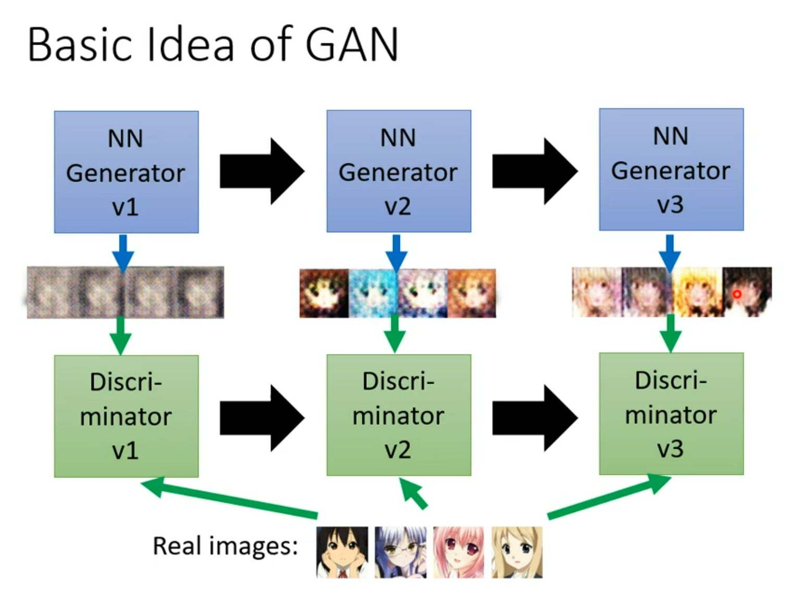
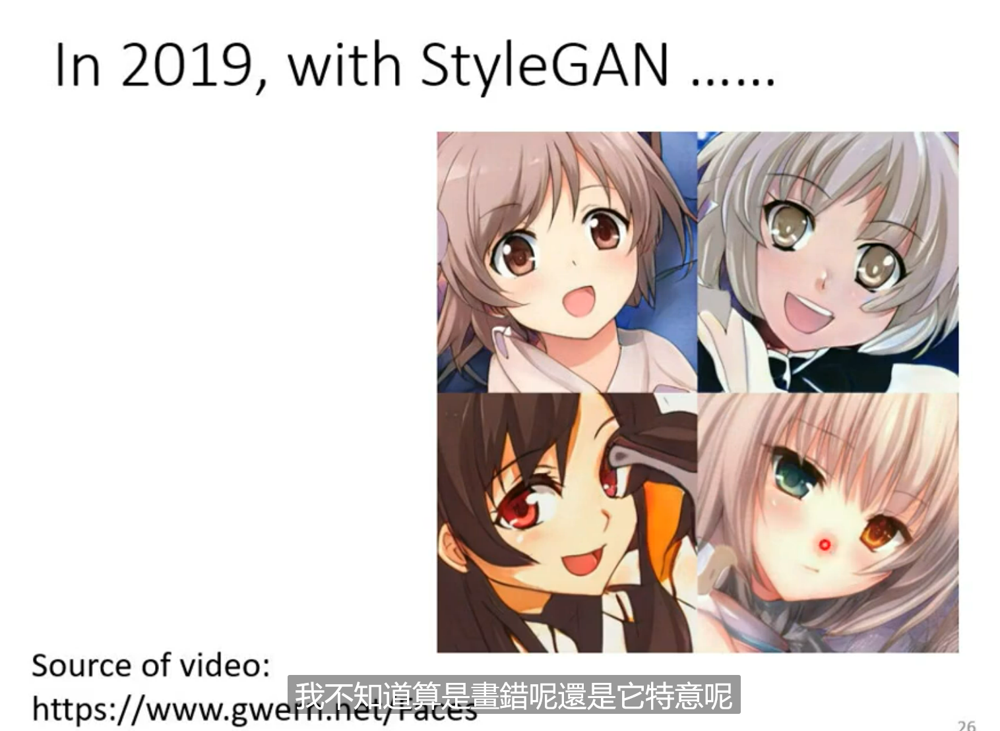
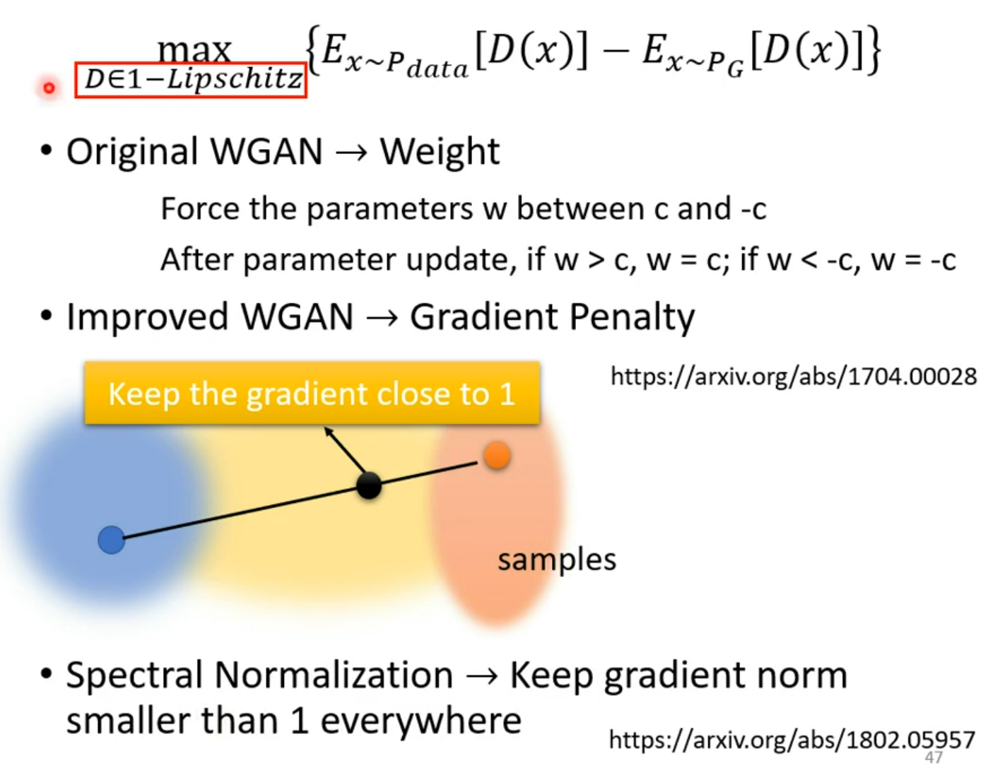
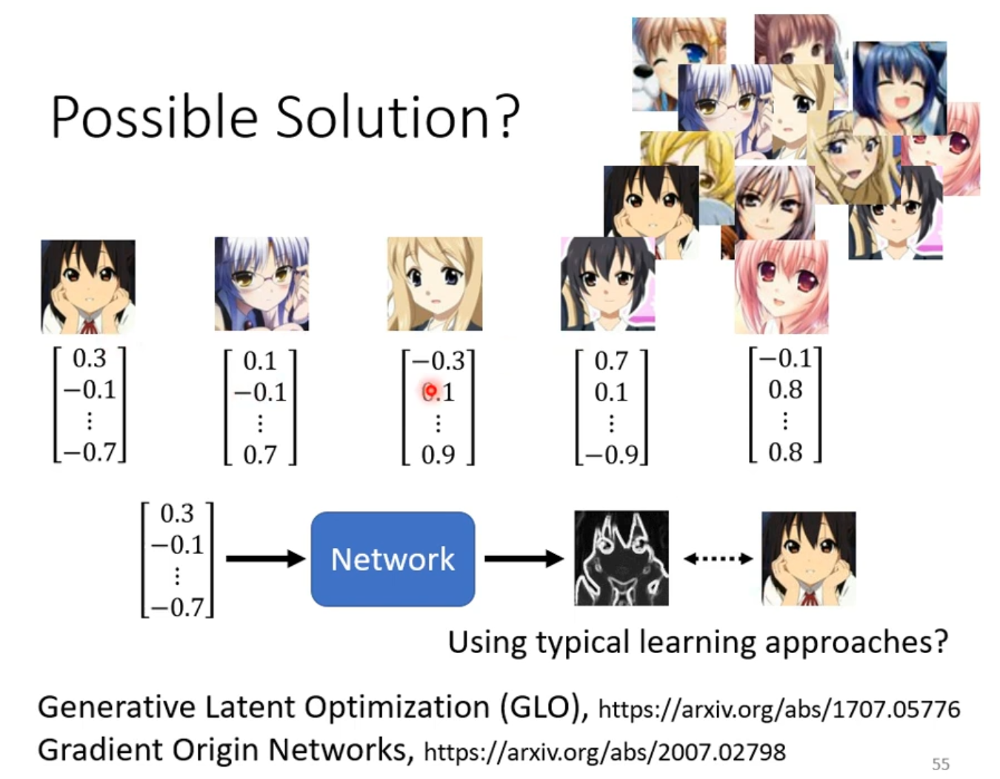
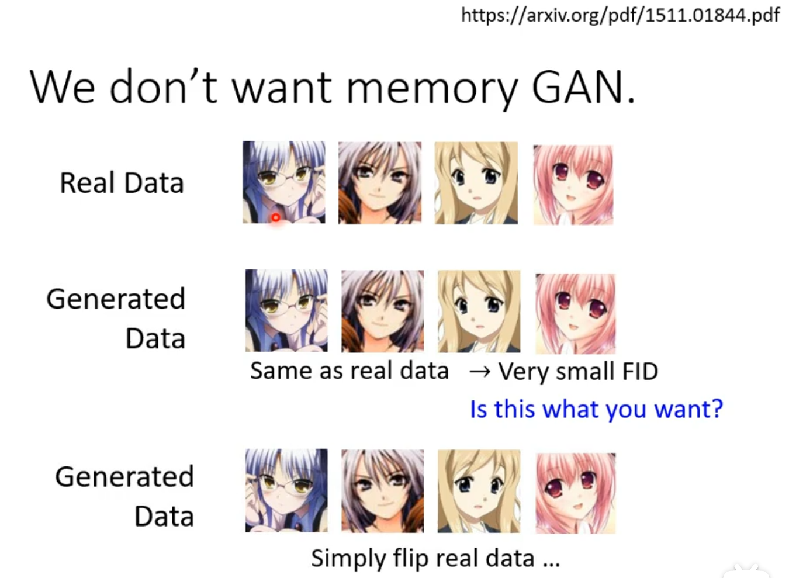
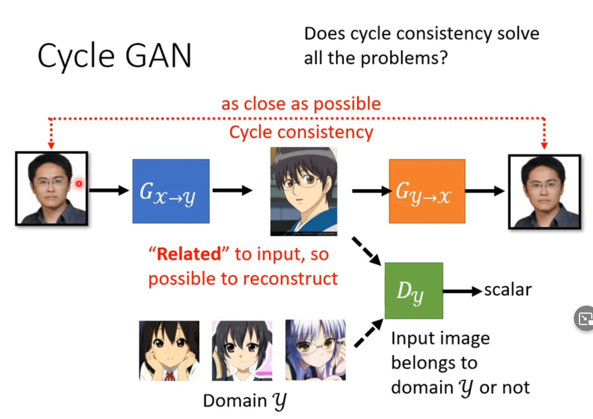
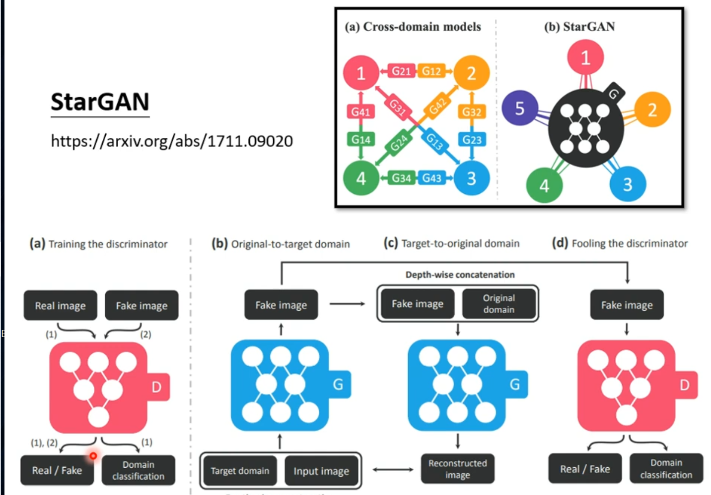

## GAN (1)

- Network as Generator

- 
- Simply Distribution-->Complex Distribution
-  

    

- In formal network structure, the training data have different directions.
- For many tasks, outputs should have some **limitation**.
- Thus change the output to Distribution

- ### Why distribution?

- Especially for the tasks needs =="creativity"==
  - The same input has **different outputs**
  - E.g. Drawing, Chatbot
  - 

### Generative Adversarial Network (GAN)

- Anime Face Generation
  - Unconditioanl generation
    - without $$x$$
  - **Discriminator**
  - 

  - 

 
- **adversarial**

- 

- Regression && Classification

- 

- **Step3:**

- 

- 

  

  
  

  
  
- 

- 

- 

---

## Theory behind GAN （2）

- $$
  G^{*}=\arg \min _{G} \textit{Div}\left(P_{G}, P_{\text {data }}\right)
  $$

  

- **Divergence**-->==How to compare the divergence ?==

  

- We can **sample** the data to esitimate divergence.

> 1406.2661

- Discriminator-->binary classifier
- $$G^{*}=\arg \min _{G} \textit{Div}\left(P_{G}, P_{\text {data }}\right)\ \rightarrow D^{*}=\arg \max _{D} \textit{V}\left(D, G\right) $$
- $$V(G, D)=E_{y \sim P_{\text {data }}}[\log D(y)]+E_{y \sim P_{G}}[\log (1-D(y))]$$

- $$G^{*}=\arg \min _{G} \textit{Div}\left(P_{G}, P_{\text {data }}\right)\ \rightarrow G^{*}=\arg \min _{G} \max _{D} V\left(G,D\right)\ $$

> 1606.00709

### Tips for GAN

- **JS divergence has problem.**

    

- **Wasserstein distance** is better
  - but it needs solving a **optimization problem**
  - 
- 
  
  - eye sight evolution
  
- WGAN

  - 

    

  - $$
    \max _{D \in 1-Lipschitz}\{E_{y\sim P_{data}}[D(x)] - E_{y\sim P_G}[D(x)]\}
    $$

  - 

  - 

---

## GAN(3)

- Spectral Normalization: **SNGAN**

- Problem:
  1. D can't tell the difference
  2. G fail to improve
  3. D fail to improve
  4. G can't fool the D

- 

- 

- > 1511.06434
  >
  > 1606.03498
  >
  > 1809.11096

- GAN for Sequence Generation

- Decoder->(max)-> Discriminator: unchanged

- 

- Why CNN(Max pooling) can ?

- Use **Reinforcement Learning**

  - 
  - 

- more : VAE Flow-based Model

- Why can't use **Surpervise**(under observation) **Learning**

- 

  

  ### Evaluation of Generation

  

  
  

- Mode Collapse

- 

- Mode Dropping

- 

- 

  
  

  
  - High **Quality** : more ==concentrate== for **each output classify**
  - High **Diversity** : more ==average== for **one input's outputs classify** in different stage

- 

- FID
- 

> [弗朗明歇距离（frechet distance） - 知乎 (zhihu.com)](https://zhuanlan.zhihu.com/p/265457722)

> 1711.10337

- 

- >  evaluation: 1802.03446

   

### Condition Generation

- Conditional GAN
- 
- 
- Besides,  tell the discriminator bad output **if the image donot corrospond with text**

- GAN+Supervised

- 

- > 1808.04108

  

---

## GAN(4) Cycle GAN

###  Learning from Unpaired Data

- In unsupervise learning
- 
- 
- ==Idea: Domain $$x, y$$ is also  a distribution==
- 
- The output of $G_{x \rightarrow y}$ should be similar to domain $y$ 
- 
- So add the check: $G_{y \rightarrow x}$ Cycle consistency

- 
  - symmety
  
- 

- 

- 

     

- 

     

     ---

     

