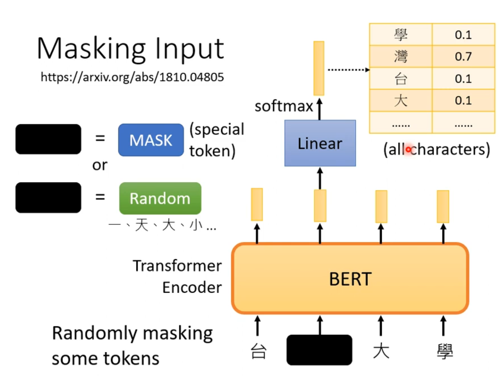
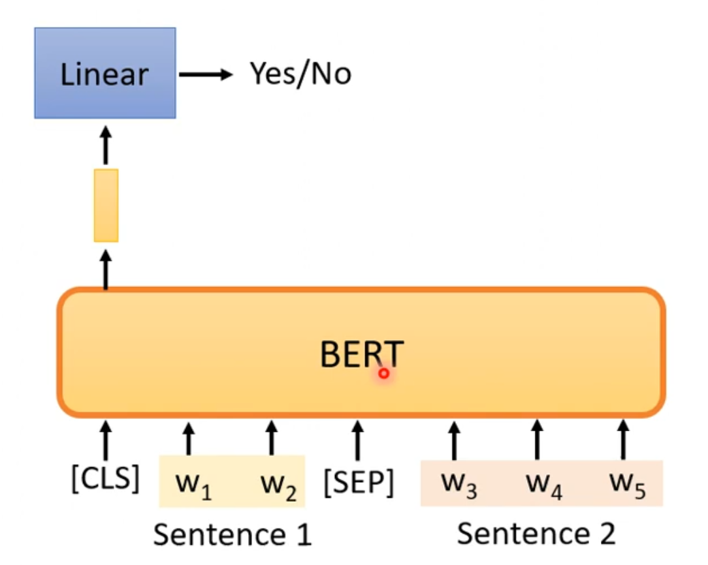
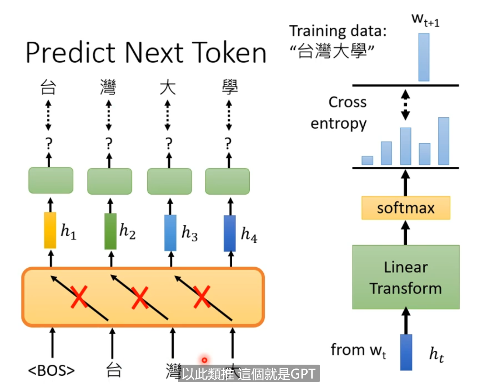
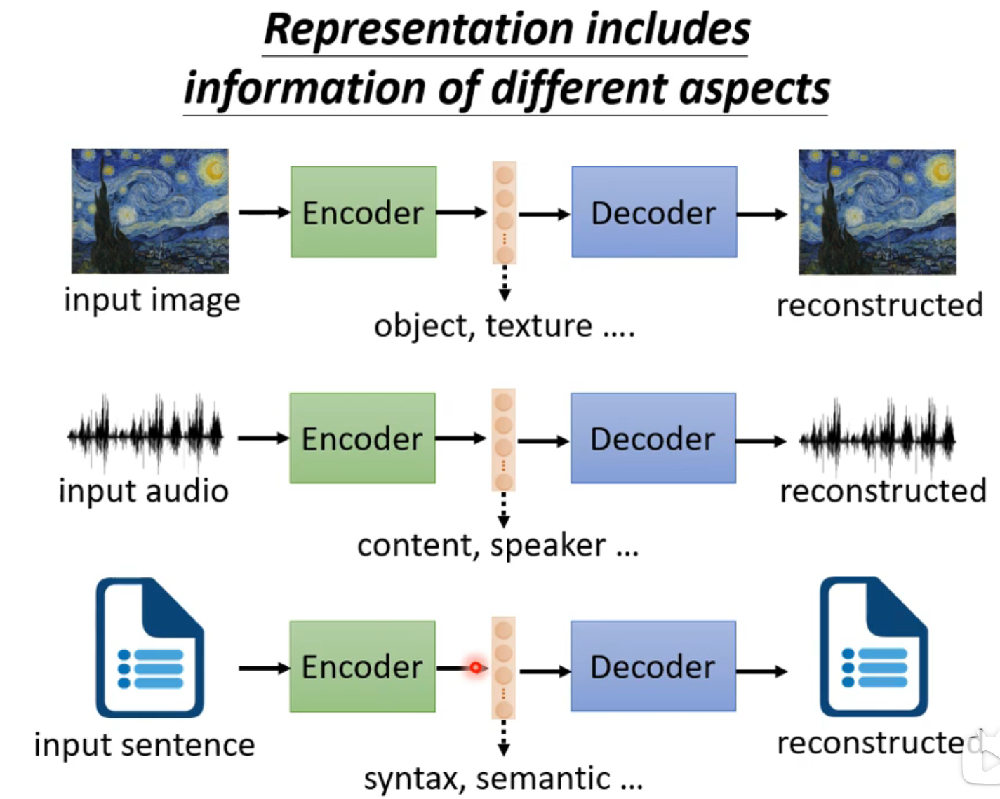

# Self-Supervised Learning

## 1.

- BERT
  - 340 million parameters
  - 
  - 
  - 

## 2. Self-supervise Learning

- $S_{self-supervise}\in S_{un-supervise}$​

 

     

    

- Bert : A classification
  - **the number of kinds is the number of word vocabulary**
  - Learn to **"fill the blank"**

- Next Sentence Prediction
  - 
  - [CLS] | - Sen~1~ - | [SEP] | - Sen~2~ |...
  - 
  - the output of [CLS] **judge whether Sen~2~ is next to Sen~1~** 
  - Manybe not work
    - It's too ==easy== for the **BERT**
  - SOP:
    - 
- **BERT:**
  - Mask token prediction
  - Next Sentence Prediction
- **Downstream Task**
  - The tasks we care
  - We have a little bit labeled data

### **Pre-train -> Fine-tune**

- 

- Datasets: GLUE 9
  - 

- Black Line: human ablility
- Case1: Sentiment analysis
  - 
  - ==Init of BERT is pre-trained by **"fill the blank"**== 
  - 
- Case2: POS tagging
  - 
- Case3: NLI
  - 
  - 
  - ==[CLS]: classification==
- Case4: Extraction-based Q&A
  - 
  - 
  - 
  - The length of BERT : 512   (Not too long)
  - Divid the long documnet into shorter, and put in in order.
- 
- 
- What dose BERT learn in pre-train ?
  - The answer is counterintuitive.

### **Seq2seq**

- 
- 

- Why?

- BERT is an encoder represent same meaning

- In pre-train, BERT seems to "**learn**" the meaning of each word.
- ==You shall know a word by the company it keeps.== 
- 
- **Word embedding --> Contextualized word embedding**

### A problem  

- 

- A mass train--> good output

### Multi-lingual BERT

- 
- 
- 
- 
- May be it's very close to the same meaning words in different language

- 
- 

- Weird
  - 
  - If the embedding is language independent.
    - How to correctly reconstruct?
      - There must be language information
  - 
  - It seems like English word is a **"small move"** to Chinese word.
  - 
  - 

## 4. GPT

- Predict Next Token

- 

- 

- > https://app.inferkit.com/demo

- 

- 

- more task 

- Image - SimCLR
  - 

### SUPERB - GULE 

- 

---

# Auto-encoder

## Basic idea of Auto-encoder
### Self-supervised learning

- Auto-encoder == Self-surpervise
- 
- 

    

- Auto-encoder ~~ Cycle GAN
  - Vector: embedding "bottleneck"
  - **Dimension reduction** 

### Why Auto-encoder ?

- In image, it has  many redundancy (冗余) .
- It can be compressed by few base vector.
- 

### Former study 

### De-noising Auto-encoder

- BERT is another "De-noising Auto-encoder"

## Feature Disentanglemnet

-  **Disentanglemnet** : the act of releasing from a snarled or tangled condition
  - 
  - 

### Voice Convers

## Discrete latent Representation

- phonetic : of or relating to speech sounds

- Text: Summary ? 

- Problem: the "summary" can't be understand.

- Can't to train --> **RL** 

### Tree Structure

## More

### Compress

### Anomaly Detection

- Application
  - Fraud Detection
  - Network Instrusion Detection
  - Cancer Detection
- Binary Classification?
  - NO! We only have one calss.
  - 

