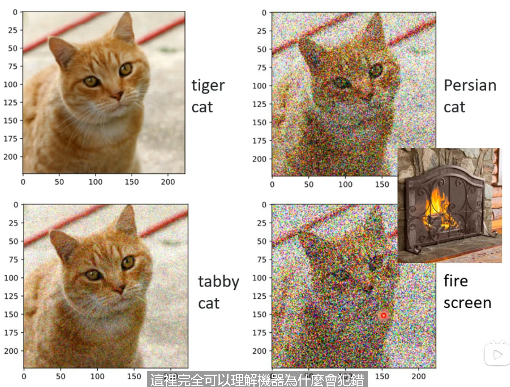
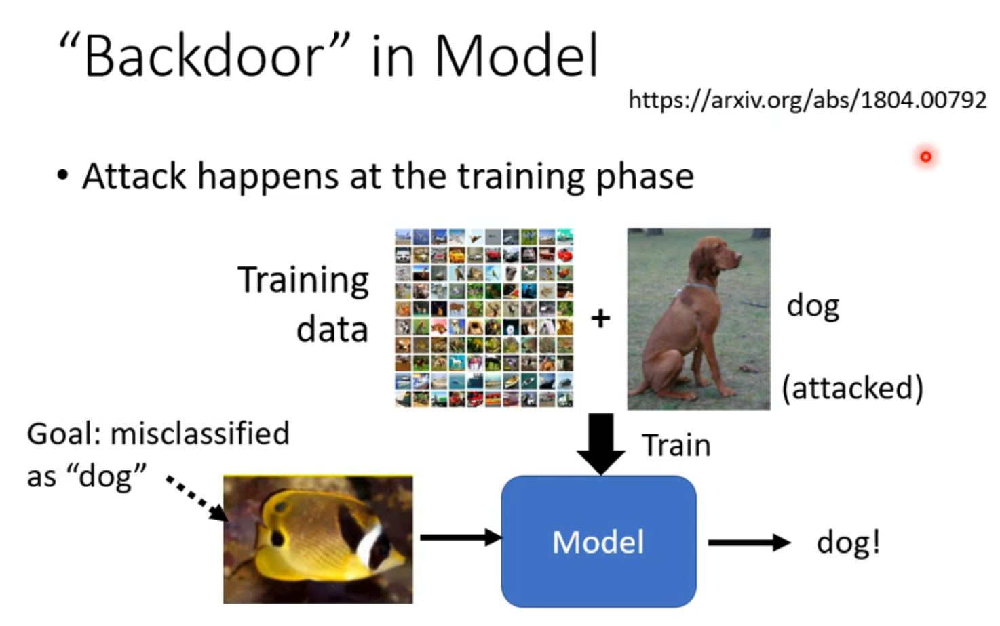
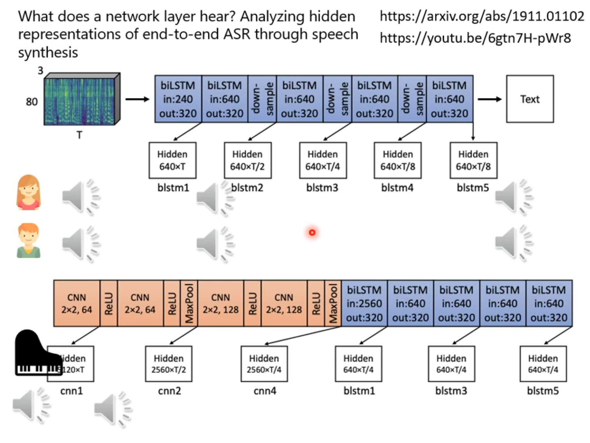

# Adversarial Attack 

## (1)Local Explation

- 

### How to Attack

- Attack
  - Non-targeted
  - Targeted

- Normal Noise

- Optimization

    

- To find
  $$
  \pmb{x^*}=\arg \underset{d(\pmb{x}^0,\pmb{x}) \leq \varepsilon}{\min} L(x)
  $$

  - Find $d$ 
  - 
  - **L-infinity > L2-norm** 
  - ==Need to consider human perception== 
  - ==Need domain knowledge== 

### Attack Approach

#### FGSM

- simple baseline

#### Interation FGSM

- medium baseline

## Adversarial Attack (2)

### White & Black box

- Black box attack is **possible** \
- 
- **Use "Proxy"**
- 

### If we **don't know** the training data ? 

- Put new data into the model and get  outputs.

- Ensemble Attack --> Ensemble learning
  - Mixed model

### Why attack is so easy?

- The **weak** derection is narrow for most network.
  - 
- problem maybe come from the data
- One pixel attack
  - 

- Universal attack

  - 

    

### Beyond Image

### Attack the Physical world

- Consider
  - Different point of view.
  - Camera's capture accurateness.
  - The color affected by actual world.

### Adversarial Reprogramming

### Blackdoor in Model

- **Be careful of unknown dataset ......**

### defense

- Passive Defense
  - 
- 
- Fliter : Smoothing
  - Side effect
- 
- If attacker known the method, it can't work soon.
- **Add Randomization Defend method**
  - 
  - **Universal attack**

### Proactive Defense

- Adversarial training
  - 
  - ==Data Augmentation== 
  
  > Adversarial Training for free!
  >
  > 1904.12843

# Explainable Machine Learning

## (1)

### Why we need explainable ML?

-  We want to the reason behind decision
- 
- 
- 

### Interpretable && Powerful

- Explainable && Interpretable
  - Explainable: Black box --> Grey & White
  -  Interpretable： capable of being understood

### Decision Tree

- It also a **"Black box"** 

### Goal for explainable ML

- Completely know how the **whole** model works ?
  - But we trust the desicions of huamn. 
  - The **reason** is important.
  - 

- 

### Case

### Local Explaination

- Find the important component:
  - Removing or change the components
  - Large decision change
  - **-->** Important component

- Use **shelter** to **confirm** 

- Analyze Gradient
  - 
  - Saliency Maps
- 
- 
- High test accuracy ==98.4%==

    

### Limitation

- Add the random noise and **Take the intersection** 
- Gradient can't **reflect** importance
  - 
- How to see the change in input data?
  - 
- 
- Attention
  - 
  - 
  - Be careful about the classifier you use.
- 
  - Aim to clean the member of voice
    - put the input data (voice)
    - Use probing TTS to reconstruction the voice
    - Compare the reconstruction  voice and input voice
    - To confirm this model understand "non-member" voice

---

## (2)Global explation: explain the whole world

### What does a filter detect ?

- Find $X^*$ ​
  - 

- Each fliter has it direction

- Look Output $y_i$ 

  - 
  - Consider Adversarial attack.

- 

  - Make $X^*$ more like "number"
    - Add $R(X)=-\sum_{i,j}|X_{ij}|$​ to **estimate** how it like
    - Less "white point"
    - 

  

  ### Constraint from Generator

- 

$$
\text{Find} &X^*=\arg \underset{X}{\max}y_i \\
& \Rightarrow z^*=\arg \underset{z}{\max}y_i \\
& \text{Show Image:} \ X^*=G(z)
$$

> 1612.00005

### Outlook

