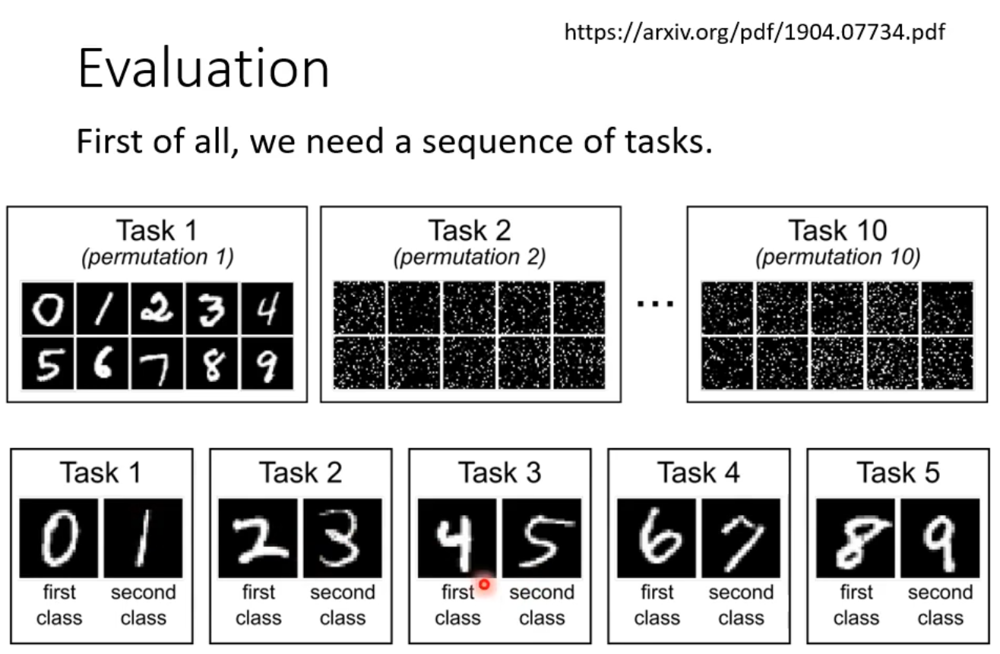
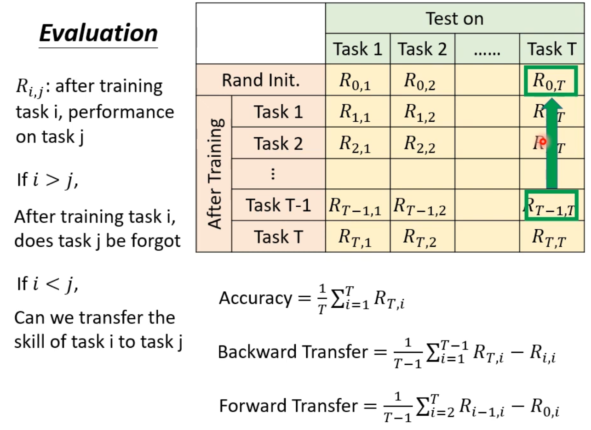
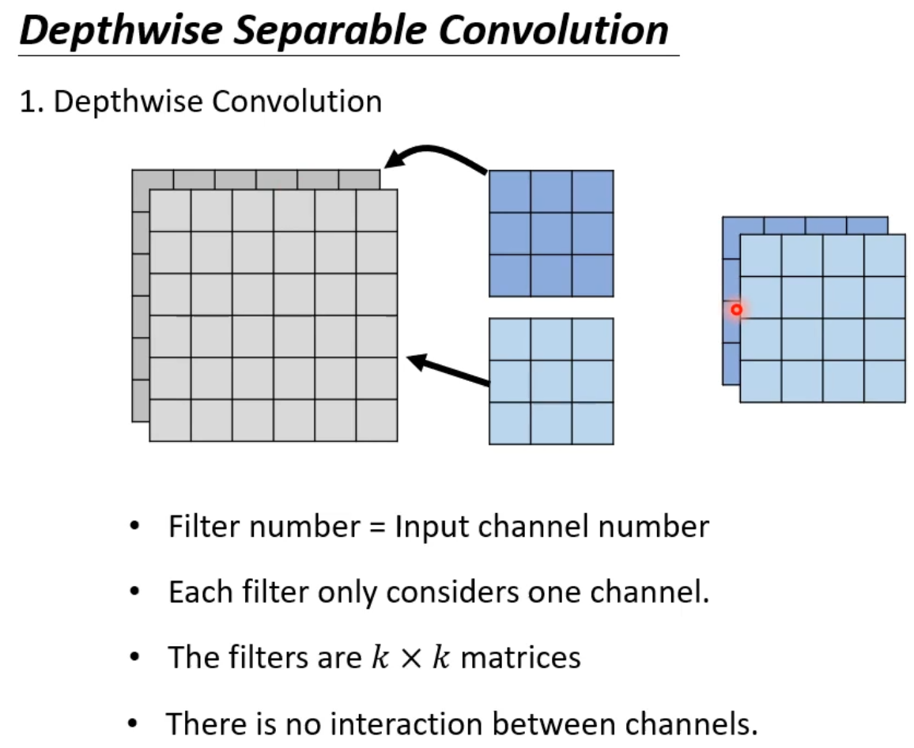
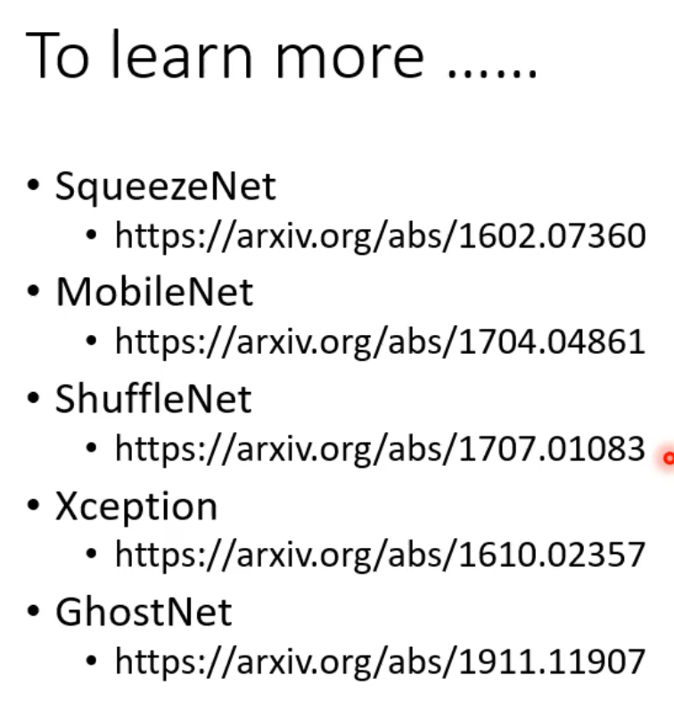

# Life Long Learning

## (1) 

### LLL

- Self learning

- **Example 1**
  - Learn task 2 in the base of task 1
  - 
  - **Forget**
  - But actually the network has **enough capacity** to learn both tasks.
    - 
- **Example 2**
  - 
  - 
  - Forget ?   No !
  - 

### Catastrophic Forgetting

- Multi-task training -> ==Upper bound==
  - Storage issue && Computation
  - 
- Train a model for each task
  - 
    - We can't store all the model.
    - Knowledge can't transfer across different tasks.
- Life-Long && Transfer
  - 
  - More emphasize on **all tasks**

- Evaluation

  - 

  - 

  - 

  - $$
    R_{i,j}:\ \text{after trianing task i, perform on task j}\\
    \text{If}\ \ i>j, \ \text{then the task i's experience was} \pmb{forget}; \\
    \ \ \ \ \ \ \ \ \  \text{else} \ i<j,\ \text{We can transfer the skillof task i to task j}\\
    \\
    BT: \frac{1}{T-1}\sum_{i=1}^{T-1}(R_{T,i}-R_{i,i})
    $$

  - 

  - $$
    FT: \frac{1}{T-1}\sum_{i=2}^{T}(R_{i-1,i}\ -\ R_{0,i})
    $$

### Resarch Directions

#### Selective Synaptic Plasticity

- Why catastrophic fogotting happened ?
  - 
- practise
  - 
  - $L'(\theta)=L(\theta)+\lambda \sum_{i}b_i\left(\theta_i -\theta_i^b \right)^2 $​ 
  - 
- How to decide correct $b_i$​ ?
  - 
  - 
    - **Limited parameters' direction** 
  - ​	 
    - 

==Different task order affect the perfomer== 

- GEM
  - 
  - It's **accepted** if GEM **don't** save much data of previous tasks.

#### Additional Neural Resource Allocation

- Progressive NN
- 
  - 

- 

#### Memory Reply

- Generating Data
- 
- 

#### Curruculum Learning

  

## (2) Network Compression

### Smaller Model

Only on soft-ware solution.

### Network Pruning

-  Human brain : less-> more->medium

- Practical issue
  - 
  - hard to speed up
  - 
  - 
- Train small network -> Enlarge then 
- Why not train a small network?
  - 
  - 
  - Lottery Ticket Hypothesis
  - 

**"我只是把困在石头里的大卫释放出来了"** 

- 

- 

### Knowledge Distillation

- Student Network study from teacher

  - 
    - It can learn some classifies never seen.
    - 

  -  **Softmax - trick** 
  - Train from each network
  - 
  - 

### Parameter Quantization

- Less accuracy
- Weight clustering
- Huffman Encoding
- 
-  Binary Weight
  - 
  - 
    - More limit - > Less overfitting
  - 

### Architecture Design

- Depthwise Separable Convolution
  - 

    

    

- Compress

- Low rank approximation
  - 
  - $W=U\times V$​​ but $Rank(W)<k$​​  
  - 
  - 
  - 

### Dynamic Computation

- Auto-controled Layer : Depth & Width
  - 
  - 
- 
  - 

