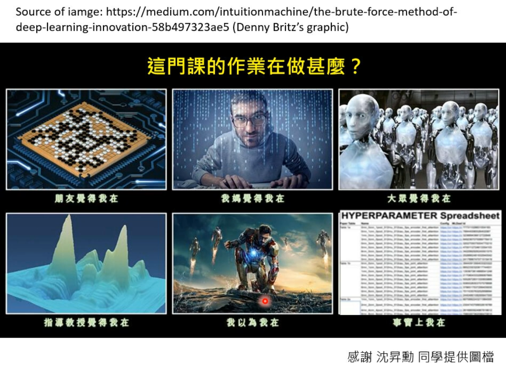
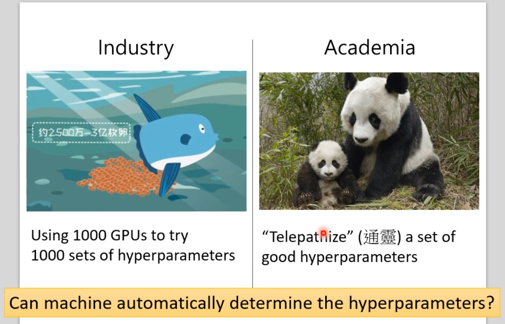
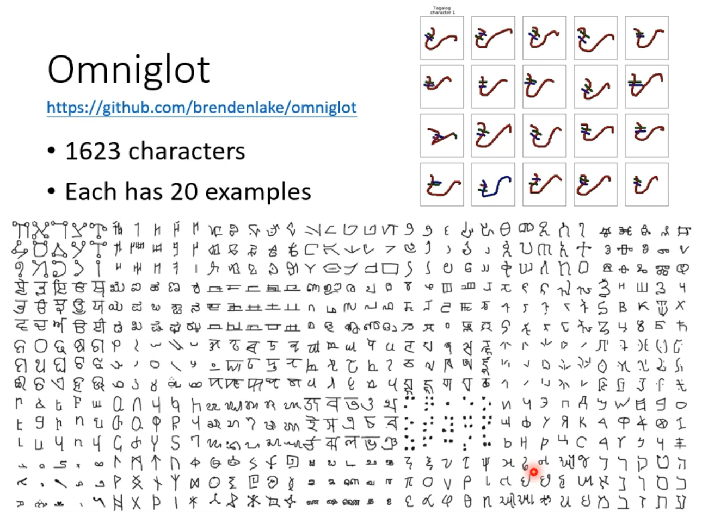

# Meta Learning : Learn to learn

## (1) Three steps

### Machine Learning

- Step 1

- Step 2
  - 

- Step 3
  - 
  - 

### Meta Learning

- Meta-learning :  **Learn an optimized algorithm **  

  -  *Step 1:*

    - 

  - *Step 2:*

    - 
    - Define $L({\color{blue}\phi})$​​​​ ​​ 
    - \
    - 
    - 
    - Total loss: $L(\phi)=\sum_{n=1}^{N}l^n$​ 

    

    

- 
  - *Step 3*	
    - 
    - 
    - Few-shot learning
    - 

### ML && Meta

- Goal

- Training Data

- Task Training

- 
- Loss
  - 
  - 
- The Same
- 
  - Also need hyperparameter ... ...
-  

## (2) Everything can Meta

### What is Learnable in a learning algorithm ?

- Training MAML

- MAML
  - Self-supervised Learning
  - 
  - 
  - **Multi-task Learning** 
  - 
  - Isn't it domain adaption / transfer learning ?
  - 
    - 

### Optimizer

- LSTM -> Optimize

### Network Architecture Search (NAS)

$$
\hat{\phi}=\arg \underset{\phi}{\min} L(\phi)\\
BUT: \nabla_\phi L(\phi)=?
$$

- DARTS: Can analyze Gradient
- Data Augmetation

- Sample Reweighting

- Beyond Gradient Decent

- Not divided Training data and Testing data

### Application

- Few-shot Image Classification
  - N-ways K-shot
  - 
  - 
  - 
  - 
  - 

