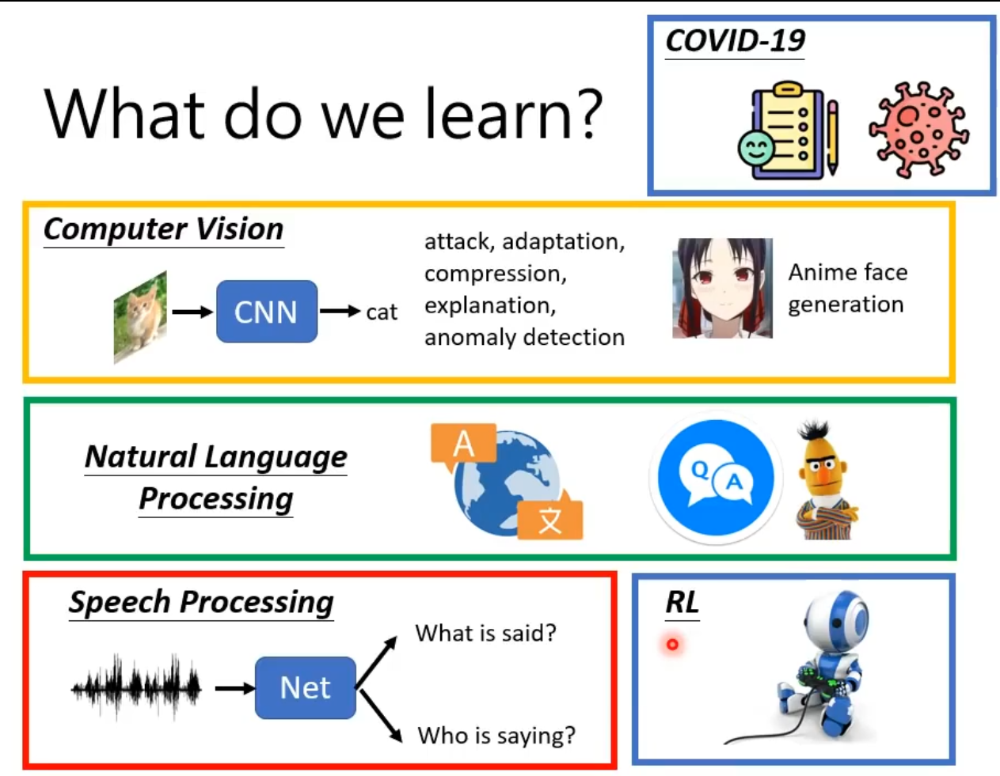
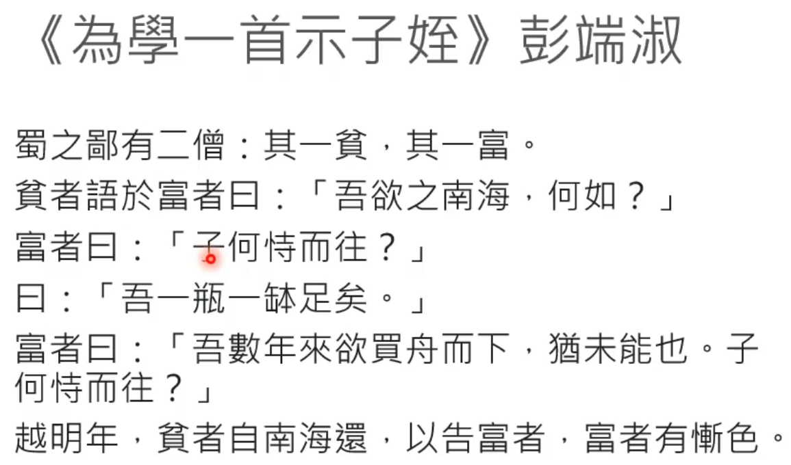

# The end

- Class
  - Deep learning
  - Differrent Input
    - 
  - GAN
  - BERT
  - Domain Adaptation
  - RL
  - Attack & Defense
  - Explainable ML
  - Network Compression
  - Life-long learning
  - Mata learning
    - 

- HW

  - COVID-19

  - CV

  - NLP

  - SP

  - RL

    - 

    

- One Day tour - ML
  - 

## Next

